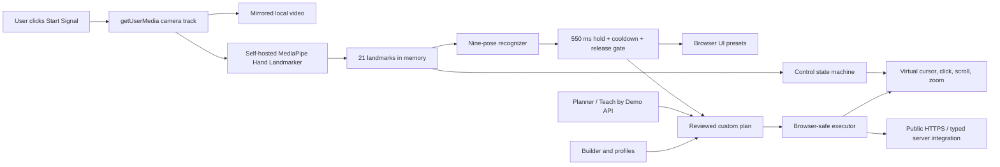

# Signal architecture

Signal ships as one public HTTPS browser application.

## Runtime ownership

- `CameraControlPanel` owns permission requests, camera lifecycle, frame
  scheduling, MediaPipe loading, landmark rendering, and telemetry.
- `ControlGestureEngine` owns relative pointer motion, pinch hysteresis, one
  quick-release click, dominant-axis locking, incremental scroll/zoom, and
  tracking-loss reset.
- `recognizeCommandPose` classifies One, Two, Three, Four, Five, Thumbs Up,
  Thumbs Down, C, and Fist from landmark geometry.
- `CommandGestureEngine` owns the 550 ms stable hold, 800 ms cooldown, one-shot
  firing, and pose-change/hand-loss rearm.
- The planner, Fist editor, visual builder, profiles, and sharing APIs accept
  schema version 1 but enforce the smaller browser-safe action catalog.
- The browser executor supports public HTTPS navigation, bounded waits,
  notifications/overlays, speech, sound, Signal-page media control, and the
  typed Discord route. It rejects legacy native actions.

## Privacy and lifecycle

Camera frames and landmarks are not uploaded for gesture recognition and are
not queued. Visibility loss pauses processing. Stop, permission failure, and
unmount stop every media track, cancel animation, close the landmarker, clear
gesture state, and reset controls.

Teach by Demo is separately initiated and may send 6–10 compressed keyframes
after disclosure and review; raw recordings remain local.

## Legacy source

`macos/**`, native packaging scripts, and historical release documents are not
in the production dependency graph. The exact pre-pivot merged commit is also
preserved on `codex/archive-native-web-2026-07-24`.
