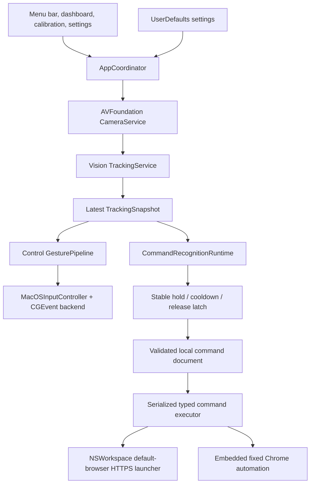

# Signal architecture

The canonical product is one native macOS application, `Signal.app`, built
from the root `Signal.xcodeproj` and shared `Signal` scheme. Its production
composition lives under `Signal/`.



There is no production website, extension, server, localhost service, native
messaging host, XPC service, or helper process.

## Composition and ownership

- `Signal/App/SignalApp.swift` creates the single production object graph.
- `AppCoordinator` is the main-actor integration and safety owner. It
  serializes mode transitions, permissions, camera demand, lifecycle changes,
  tracking delivery, command execution, and shutdown.
- `CameraService` owns one AVFoundation capture session and generation lease.
  It targets VGA input at 30 FPS, keeps only bounded/latest work, and rejects
  stale generations.
- `TrackingService` runs Vision hand-pose detection, maps and filters
  landmarks, estimates palm scale, associates hand identities, and publishes
  immutable `TrackingSnapshot` values with quality and degradation reasons.
- `GesturePipeline` and `GestureEngine` own Control-mode pointer and pinch
  transactions.
- `SignalCommandRecognitionRuntime` independently owns Commands-mode
  recognition and activation. It consumes exactly one current reliable hand,
  uses capture monotonic timestamps, and never emits Control input.
- `MacOSInputController` is the only native Control output path. Its output
  gate, generation checks, modifier policy, and release logic fence Core
  Graphics events.
- `SignalCommandExecutor` serializes one typed plan at a time and applies
  cancellation and step/plan timeouts.

## Mode and safety isolation

`SignalMode` has exactly three cases:

- **Paused** is the launch and quiescent state. Output is gated off and owned
  inputs are released. Calibration may request camera observations while
  output remains blocked.
- **Control** enables native pointer output only after Camera,
  Accessibility, emergency-monitor, active-session, running-camera, current
  capture-generation, and good-tracking gates pass.
- **Commands** disables the Control gate, resets Control gestures, releases all
  held input, and enables only command recognition and execution.

Every mode transition resets the other mode's state. Tracking loss, stale
timestamps, ambiguous hands, camera interruption/failure, permission loss,
sleep, inactive login session, display reconfiguration, editor entry,
Emergency Stop, and shutdown revoke pending output or execution as appropriate.
Latest-only main-actor delivery and capture-generation checks prevent queued
old frames from becoming fresh output.

The menu Emergency Stop always routes through the coordinator.
Control–Option–Command–H is an additional local/global monitor path when macOS
allows the monitor to be installed; its availability must not be assumed.

## Control pipeline

Control uses deterministic geometry derived from palm-normalized landmarks:

1. An index-only pointer pose establishes an anchor without moving the cursor.
2. Subsequent relative fingertip motion passes dead-zone, smoothing,
   sensitivity, acceleration, and maximum-delta policies.
3. Thumb–index closure starts one pinch transaction and freezes pointer motion.
4. A short, low-motion release produces at most one click.
5. Dominant vertical movement locks scroll; dominant horizontal movement locks
   application zoom. A locked axis cannot switch before release.
6. Release, tracking loss, mode change, or any safety fence terminates the
   transaction and releases owned input.

Control produces native Core Graphics events and therefore requires
Accessibility approval. It does not bypass secure input, login/lock screens,
authorization dialogs, protected system surfaces, or target-application
policy.

## Command recognition and schema

The geometry-facing command set and persisted semantic catalog both contain
exactly:

1. One
2. Two
3. Three
4. Four
5. Thumbs Up
6. Thumbs Down
7. C
8. Fist

Five is intentionally absent. Recognition requires exactly one current,
reliable hand, stable capture timestamps, confidence gates, a stable hold, one
trigger, release/change rearm, and cooldown. Progress and trigger values are
pure data until `AppCoordinator` performs a validated command lookup.

The persisted document is schema version 1 and catalog version 1. Validation
requires exactly eight unique commands in canonical order. Seven presets must
exactly match the built-in model definitions; only Fist is configurable.
Unknown JSON fields, future versions, duplicate identifiers, missing gestures,
unsafe text, excessive file size, and unsupported actions fail closed.

The executable action enum has only:

- `open_url`, containing one public HTTPS URL;
- `bolt_submit_prompt`, containing the exact reviewed built-in prompt; and
- `spotify_next_track`, with no arbitrary parameters.

Plans contain one to fifty bounded-timeout steps with explicit stop/continue
failure policy. There is no shell, process launch, arbitrary AppleScript,
arbitrary JavaScript, generic HTTP request, selector, or inline-secret action.

The URL policy requires HTTPS, a public DNS-style hostname, optional port 443,
and no authority credentials. It rejects localhost, local/internal suffixes,
IP literals, unsafe schemes, malformed authority, and private or reserved
literal forms.

## External adapters

Approved HTTPS URLs are opened with `NSWorkspace` in the user's default
browser. Generic `open_url` actions do not select or automate Chrome.

Bolt and Spotify use fixed AppleScript and page JavaScript compiled into
`Signal.app`; command documents cannot provide either source:

- Apple Events target only Google Chrome.
- Candidate tabs must match the exact `bolt.new` or `open.spotify.com` HTTPS
  origin.
- Page code repeats the origin check and requires one visible, enabled,
  expected control.
- Spotify records the current track identity, invokes one next action, waits,
  and requires a changed identity before reporting success.
- Missing permission, Chrome, JavaScript-from-Apple-Events setting, tab,
  control, or verification returns a typed failure.
- Bolt failure may copy only the fixed reviewed prompt to the system clipboard
  and requires manual paste/submit.

Automation never receives camera frames, landmarks, settings, or arbitrary
command-authored script.

## Persistence and privacy

- Commands are atomically stored as sorted JSON at
  `~/Library/Application Support/Signal/Commands/active-v1.json`.
- Gesture tuning and zoom settings use the local `Signal.settings.v1`
  `UserDefaults` entry.
- Optional-permission attempt flags are local `UserDefaults` booleans.
- Tracking frames, landmarks, recognition state, dashboard activity, and live
  diagnostics remain in memory.

The app has no direct network, analytics, advertising, remote-log, account, or
upload client. External network behavior belongs to the browser after a typed
command deliberately opens or controls an approved HTTPS service. See
[Privacy](PRIVACY.md).

## TCC boundary

- Camera is required for tracking.
- Accessibility is required for native input and relevant global observation.
- Chrome Automation is optional and limited to reviewed Bolt/Spotify actions.
- Screen Recording is not required, requested, or used by the production
  composition. Teach by Demo records structured local event and Accessibility
  proposals, not screen pixels. Screen Recording would not itself grant
  Accessibility.

Construction performs passive setup only; visible actions request permission.
No component can grant its own TCC access. Permission continuity across rebuilt,
relocated, or differently signed bundles is not guaranteed.

## Teach by Demo boundary

The production composition wires the bounded, listen-only structured capture
adapter into the Fist command editor. Capture starts only from an explicit
visible action, has a visible recording state and Stop/Cancel controls, and is
bounded by the selected 30- or 60-second limit. It records local event and
Accessibility-derived proposal metadata in memory; it never captures screen
pixels, requests Screen Recording, or executes a proposal while recording.

Secure targets and secure-input or secret-like content are omitted and counted
as redactions. The user can review, reorder, delete, or reject proposals before
applying them. The current closed executable schema can save only a reviewed
public HTTPS proposal; generic click, text, key-combination, and wait proposals
remain visibly unsupported and cannot become executable steps. Unit tests do
not establish physical event capture on a particular installed build.

## Packaging boundary

The native scripts build the root `Signal` scheme for macOS `arm64`, validate
bundle identifier `com.allenxu.Signal`, and stage only:

```text
artifacts/native/Signal.app
artifacts/native/Signal-local.zip
artifacts/native/Signal-local.dmg  # optional
```

They reject nested applications, app extensions, XPC services, and web,
extension, server, or helper payloads. They do not notarize, staple, upload, or
prove installation. See [Native installation](NATIVE_INSTALLATION.md).

## Archived source and unsupported claims

`extension/`, `web/`, `shared/`, and the older `macos/` implementation are
repository history only. They are not part of the product dependency graph,
package, runtime, or installation instructions.

The supported build target is macOS 13 or later on Apple Silicon. The
architecture does not promise Intel, Windows, Linux, mobile, browser-only,
cross-device, managed-device, secure-surface, or arbitrary-app automation
behavior. Automated tests and builds do not establish physical-camera gesture
accuracy, TCC approval, signing, notarization, Gatekeeper, or external-site
compatibility on a particular machine.
