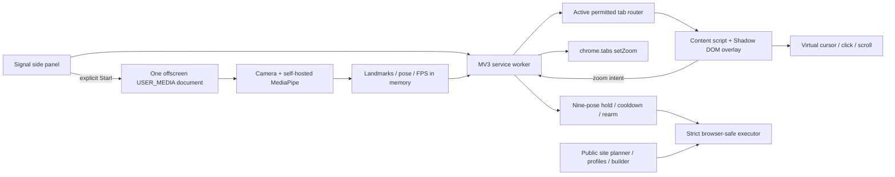

# Signal architecture

Signal ships as one Manifest V3 Chrome extension plus a public installation,
fallback, builder, profile, and planner website.

## Runtime ownership

- `extension/src/offscreen/**` owns camera lifecycle, frame scheduling,
  MediaPipe loading, local landmark processing, and telemetry. A visible
  extension setup page handles Chrome's first permission prompt when needed.
- `extension/src/content/**` owns relative pointer motion, pinch hysteresis, one
  quick-release click, dominant-axis locking, incremental scroll/zoom, and
  tracking-loss reset on ordinary pages. It renders only an isolated,
  pointer-transparent Shadow DOM overlay and never changes page layout.
- The service worker routes only to the active supported tab, owns real tab
  zoom and command execution, and resets state on navigation, tab changes, and
  worker recovery.
- The active command catalog exposes One, Two, Three, Four, Thumbs Up, Thumbs
  Down, C, and Fist with stable hold, cooldown, one-shot firing, and
  release/change rearm. Five remains classifier-only for migration safety and
  is never registered or displayed.
- The planner, Fist editor, visual builder, profiles, and sharing APIs accept
  schema version 1 but enforce the smaller browser-safe action catalog.
- The extension executor supports public HTTPS navigation, tab management,
  selectors, predefined non-sensitive text, bounded waits, page overlays,
  speech, media control, tab zoom, and typed Discord/Claude routes. It rejects
  legacy native actions.

## Privacy and lifecycle

Camera frames and landmarks are not uploaded, stored, or queued. Stop,
permission failure, extension suspension recovery, and teardown stop every
media track, cancel scheduling, close the landmarker, clear gesture state, and
reset controls.

Teach by Demo is separately initiated and captures only reviewed browser
actions. Password fields, sensitive values, raw video, and camera frames are
excluded.

## Legacy source

`macos/**`, native packaging scripts, and historical release documents are not
in the production dependency graph. The exact pre-pivot merged commit is also
preserved on `codex/archive-native-web-2026-07-24`.
