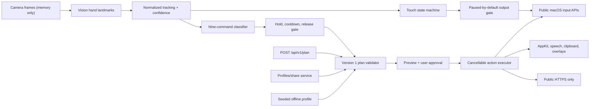

# Signal architecture

This document describes the intended release architecture. At kickoff, the
tagged repository contains no tracked implementation; module presence and
runtime behavior must be verified after integration.

## Product boundary

Signal has two runtime surfaces:

1. A native Swift/SwiftUI macOS application owns camera capture, Apple Vision
   hand landmarks, deterministic touch and command classifiers, real macOS
   input through public APIs, action execution, local profiles, permissions,
   safety gates, and the live demo.
2. A public HTTPS web service owns the landing/download site, planner API,
   unlisted profile sharing, optional server integrations, and health status.

The native app is the release of record. It may call public HTTPS endpoints but
must launch and retain its seeded demo profile with every network interface
unavailable. No localhost process is in the production dependency graph.

## Native separation

- `Camera` captures and drops frames rather than queueing Vision work.
- `Tracking` converts Vision output to a mirrored, scale-normalized, hand-local
  model independent of UI and event output.
- `TouchControl` implements pointer and the non-switching pinch axis-lock state
  machine. It owns quick-click suppression after scroll, zoom, cancellation, or
  tracking loss.
- `Gestures` classifies `one`, `two`, `three`, `four`, `five`, `fist`,
  `thumbs_up`, `thumbs_down`, and `c_shape` from geometry plus time.
- `Commands` owns stable hold, progress, cooldown, release gating, plan review,
  and macro cancellation.
- `Actions` decodes only the v1 safe action union and produces typed receipts.
- `Recorder` converts explicit controlled interactions, and optionally global
  events, into the same validated plan model.
- `Profiles` persists local non-secret data and resolves secret IDs through
  Keychain.
- `Networking` accepts environment-selected public HTTPS origins, validates
  response envelopes, and applies SSRF/redirect policy.
- `Permissions` and a single runtime lifecycle owner keep all output disabled
  until camera/Accessibility state is safe.

Pure geometry, touch, activation, schema, and macro engines should have no
SwiftUI, AVFoundation, Vision request, or real output side effects. Tests inject
monotonic clocks, fixtures, and mock executors.

## Modes and conflict ownership

- Touch Mode enables pointer, click, vertical pinch scroll, and horizontal
  pinch zoom; commands are disabled.
- Command Mode disables the four touch controls and enables all nine command
  gestures.
- Hybrid Mode enables pinch click/scroll/zoom and eight non-`one` commands.
  The default `one` behavior remains pointer; a profile may explicitly choose
  command behavior.

Mode change, pause, sleep, camera stop, tracking loss, and app termination all
cancel held touch state and command/macro execution.

## Contract and trust boundaries

`shared/action-plan.schema.json`, `profile.schema.json`, and
`planner-response.schema.json` are frozen at `schemaVersion: 1`. Swift and
TypeScript models must share fixtures and reject unsupported versions.

The JSON Schema proves shape, bounds, and HTTPS syntax. It cannot prove DNS
destinations, redirects, or whether text contains a credential. Native and
server executors therefore apply the runtime rules in `SECURITY.md`.

Planner output is untrusted input even when it came from the team's server.
The service validates once; the native app validates again, shows the exact
plan, and requires approval.

## Public service

- `POST /api/v1/plan`: size/rate-limited structured planner with deterministic
  fallback for seeded phrases.
- `POST /api/v1/profiles`: validate and redact before storing an unlisted
  profile.
- `GET /api/v1/profiles/:shareCode`: read-only redacted profile lookup.
- `POST /api/v1/integrations/discord`: optional server-side secret integration.
- `GET /api/v1/health`: deterministic, non-secret health response.

The public site provides setup, permission, download, privacy, limitations, and
submission information. Camera data never crosses this boundary.
